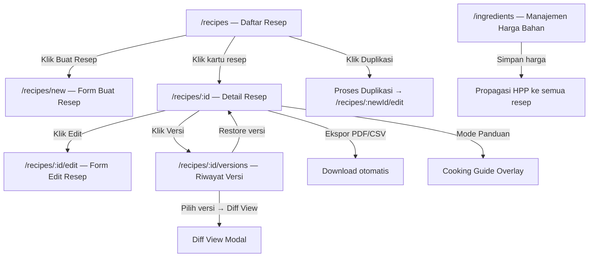
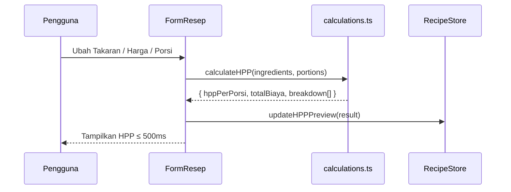

# Design Document: Standardisasi Resep dan HPP

## Overview

Modul **Standardisasi Resep dan HPP** adalah aplikasi frontend berbasis web yang memungkinkan koki dan pemilik usaha kuliner mendigitalisasi resep dari "insting/perkiraan" menjadi data metrik yang terukur dan konsisten. Aplikasi ini berjalan sepenuhnya di sisi klien (client-side) dengan state management terpusat, serta berkomunikasi dengan backend melalui REST API untuk persistensi data.

Fitur utama yang dicakup:
- Manajemen resep lengkap (buat, edit, duplikasi, versi)
- Perhitungan HPP otomatis secara real-time
- Simulasi harga jual berdasarkan margin keuntungan
- Manajemen harga bahan baku terpusat dengan propagasi ke semua resep
- Kalkulator skala porsi
- Ekspor PDF dan CSV
- Panduan memasak step-by-step

### Batasan & Asumsi Desain

- Aplikasi adalah SPA (Single Page Application) menggunakan React + TypeScript.
- State management menggunakan Zustand (ringan, cocok untuk state frontend tanpa server-state complexity).
- Untuk server-state (fetching, caching, sinkronisasi) digunakan TanStack Query (React Query).
- Styling menggunakan Tailwind CSS untuk responsivitas.
- Ekspor PDF menggunakan library `react-pdf` atau `jspdf`; CSV menggunakan native Blob API.
- Tidak ada autentikasi dalam scope desain ini — nama pengguna diasumsikan tersedia dari konteks sesi.
- Data persisten disimpan di backend; tidak ada offline-first requirement.

---

## Architecture

### Pendekatan Arsitektur

Aplikasi mengikuti pola **Feature-Sliced Design (FSD)** yang dimodifikasi: setiap fitur utama memiliki direktori sendiri dengan komponen, hooks, dan tipe datanya. Logika bisnis (kalkulasi HPP, validasi, skala porsi) dipisahkan ke dalam fungsi murni (*pure functions*) yang dapat diuji secara independen.

```
src/
├── app/                    # Setup router, provider, global styles
├── features/
│   ├── recipes/            # Manajemen resep (buat, edit, daftar, detail)
│   ├── ingredients/        # Manajemen harga bahan baku
│   ├── versions/           # Versi & riwayat resep
│   ├── export/             # Ekspor PDF & CSV
│   └── cooking-guide/      # Panduan memasak step-by-step
├── shared/
│   ├── components/         # UI primitif (Button, Input, Modal, dll.)
│   ├── hooks/              # Custom hooks umum (useDebounce, dll.)
│   ├── lib/
│   │   ├── calculations.ts # Logika bisnis: HPP, harga jual, skala porsi
│   │   └── validators.ts   # Fungsi validasi
│   └── types/              # TypeScript interfaces & types global
└── stores/                 # Zustand stores
```

### Diagram Alur Navigasi Utama



### Diagram Alur Kalkulasi HPP Real-Time



---

## Components and Interfaces

### Hierarki Komponen (Component Tree)

```
App
├── Router
│   ├── RecipeListPage
│   │   ├── RecipeSearchBar
│   │   ├── RecipeCategoryFilter
│   │   ├── RecipeSortControl
│   │   ├── RecipeCardGrid
│   │   │   └── RecipeCard (× n)
│   │   │       └── DuplicateButton
│   │   ├── EmptyState
│   │   └── PaginationControl
│   │
│   ├── RecipeFormPage (new / edit)
│   │   ├── RecipeMetaFields      (nama, kategori, porsi, deskripsi)
│   │   ├── IngredientList
│   │   │   ├── IngredientRow (× n)
│   │   │   │   ├── IngredientAutocomplete
│   │   │   │   ├── QuantityInput
│   │   │   │   └── UnitSelect
│   │   │   └── AddIngredientButton
│   │   ├── CookingStepList       (drag-and-drop)
│   │   │   └── CookingStepRow (× n)
│   │   ├── HPPSummaryPanel       (live preview)
│   │   └── FormActionBar         (simpan / batal)
│   │
│   ├── RecipeDetailPage
│   │   ├── RecipeHeader          (nama, kategori, porsi, badge harga baru)
│   │   ├── IngredientTable       (dengan kolom biaya)
│   │   ├── CookingStepList       (read-only)
│   │   ├── HPPSummaryCard        (HPP per porsi, total biaya)
│   │   ├── ProfitSimulator       (Req 4)
│   │   ├── PortionScaleCalculator (Req 9)
│   │   ├── ExportPanel           (PDF / CSV)
│   │   ├── VersionHistoryPanel   (Req 6)
│   │   └── CookingGuideOverlay   (Req 7.5)
│   │
│   ├── VersionHistoryPage
│   │   ├── VersionList
│   │   │   └── VersionListItem (× n)
│   │   └── DiffViewModal
│   │
│   └── IngredientManagementPage
│       ├── IngredientPriceTable
│       │   └── IngredientPriceRow (× n)
│       ├── DeleteIngredientDialog
│       └── SaveConfirmationToast
```

### Interface Komponen Kunci

#### `RecipeCard`
```typescript
interface RecipeCardProps {
  recipe: RecipeSummary;
  onDuplicate: (id: string) => void;
  onSelect: (id: string) => void;
}
```

#### `HPPSummaryPanel` / `HPPSummaryCard`
```typescript
interface HPPSummaryProps {
  hppPerPorsi: number;       // hasil kalkulasi
  totalBiaya: number;        // HPP × porsi
  breakdown: CostBreakdownItem[];
  currency?: string;         // default "Rp"
}
```

#### `ProfitSimulator`
```typescript
interface ProfitSimulatorProps {
  hppPerPorsi: number;
  isDisabled: boolean;       // true jika HPP = 0 atau tidak tersedia
}
```

#### `PortionScaleCalculator`
```typescript
interface PortionScaleCalculatorProps {
  originalIngredients: Ingredient[];
  originalPortions: number;
}
```

#### `DiffViewModal`
```typescript
interface DiffViewModalProps {
  currentVersion: RecipeVersion;
  selectedVersion: RecipeVersion;
  onClose: () => void;
  onRestore: (versionId: string) => void;
}
```

---

## Data Models

### TypeScript Interfaces

```typescript
// ─── Enums & Constants ────────────────────────────────────────────────────

type RecipeCategory = "appetizer" | "main_course" | "dessert" | "beverage" | "other";

type MeasurementUnit =
  | "g" | "kg" | "ml" | "l"
  | "sdt" | "sdm"
  | "buah" | "butir" | "lembar";

type RecipeStatus = "draft" | "published";

// ─── Core Models ─────────────────────────────────────────────────────────

interface Ingredient {
  id: string;
  name: string;
  unit: MeasurementUnit;
  pricePerUnit: number;        // Harga per satuan (Rp), 0 jika belum diisi
  lastUpdated: string;         // ISO 8601
  isActive: boolean;           // false jika dihapus dari manajemen bahan
}

interface RecipeIngredient {
  ingredientId: string;
  ingredientName: string;      // snapshot nama saat resep disimpan
  quantity: number;            // 0.01 – 99999.99
  unit: MeasurementUnit;
  pricePerUnit: number;        // snapshot harga saat resep disimpan
  isActiveIngredient: boolean; // false jika bahan induk dihapus
}

interface CookingStep {
  order: number;               // 1-based, berurutan
  instruction: string;
}

interface Recipe {
  id: string;
  name: string;                // max 150 karakter
  category: RecipeCategory;
  portions: number;            // 1 – 9999
  description: string;        // max 500 karakter
  status: RecipeStatus;
  ingredients: RecipeIngredient[];
  steps: CookingStep[];
  currentVersionNumber: number;
  createdAt: string;           // ISO 8601
  updatedAt: string;           // ISO 8601
  updatedBy: string;           // nama pengguna
}

// ─── HPP & Kalkulasi ──────────────────────────────────────────────────────

interface CostBreakdownItem {
  ingredientName: string;
  quantity: number;
  unit: MeasurementUnit;
  pricePerUnit: number;
  totalCost: number;           // quantity × pricePerUnit
}

interface HPPResult {
  hppPerPorsi: number;         // totalBiaya / portions, 2 desimal
  totalBiaya: number;          // Σ (quantity × pricePerUnit)
  breakdown: CostBreakdownItem[];
  isValid: boolean;            // false jika ada bahan tidak aktif / harga 0
}

// ─── Simulasi Harga Jual ──────────────────────────────────────────────────

interface ProfitSimulation {
  hppPerPorsi: number;
  marginPercentage: number;    // 0 < margin < 100
  hargaJual: number;           // HPP / (1 - margin/100), 2 desimal
  keuntunganPerPorsi: number;  // hargaJual - hppPerPorsi
}

// ─── Skala Porsi ──────────────────────────────────────────────────────────

interface ScaledIngredient {
  ingredientName: string;
  originalQuantity: number;
  scaledQuantity: number;      // (originalQty / originalPortions) × targetPortions, 2 desimal
  unit: MeasurementUnit;
  scaledCost: number;
}

interface ScaleResult {
  targetPortions: number;
  scaledIngredients: ScaledIngredient[];
  totalScaledCost: number;
}

// ─── Versi Resep ─────────────────────────────────────────────────────────

interface RecipeVersion {
  versionId: string;
  recipeId: string;
  versionNumber: number;
  snapshot: Recipe;            // salinan penuh resep pada saat versi dibuat
  savedAt: string;             // ISO 8601
  savedBy: string;
}

// ─── List / Summary ───────────────────────────────────────────────────────

interface RecipeSummary {
  id: string;
  name: string;
  category: RecipeCategory;
  portions: number;
  hppPerPorsi: number;
  updatedAt: string;
  hasRecentPriceUpdate: boolean; // true jika ada bahan diperbarui ≤ 7 hari
}

// ─── Filter & Sort ────────────────────────────────────────────────────────

type RecipeSortField = "name" | "hppPerPorsi" | "updatedAt";
type SortDirection = "asc" | "desc";

interface RecipeListFilter {
  searchQuery: string;
  category: RecipeCategory | null;
  sortField: RecipeSortField;
  sortDirection: SortDirection;
  page: number;
  pageSize: 20;
}
```

### State Management (Zustand Stores)

```typescript
// store/recipeStore.ts
interface RecipeStore {
  // State
  recipes: RecipeSummary[];
  activeRecipe: Recipe | null;
  filter: RecipeListFilter;
  hppPreview: HPPResult | null;

  // Actions
  setFilter: (partial: Partial<RecipeListFilter>) => void;
  setActiveRecipe: (recipe: Recipe | null) => void;
  updateHPPPreview: (result: HPPResult) => void;
}

// store/ingredientStore.ts
interface IngredientStore {
  ingredients: Ingredient[];
  setIngredients: (list: Ingredient[]) => void;
  updateIngredientPrice: (id: string, price: number) => void;
}
```

### Routing

| Path | Komponen | Keterangan |
|---|---|---|
| `/recipes` | `RecipeListPage` | Daftar semua resep |
| `/recipes/new` | `RecipeFormPage` | Form buat resep baru |
| `/recipes/:id` | `RecipeDetailPage` | Detail resep |
| `/recipes/:id/edit` | `RecipeFormPage` | Form edit resep |
| `/recipes/:id/versions` | `VersionHistoryPage` | Riwayat versi |
| `/ingredients` | `IngredientManagementPage` | Manajemen harga bahan |

---

## Logika Bisnis Utama

Semua fungsi kalkulasi di bawah ini adalah **pure functions** yang berada di `src/shared/lib/calculations.ts`.

### Kalkulasi HPP

```typescript
/**
 * Menghitung HPP per porsi dari daftar bahan resep.
 * HPP = Σ(quantity_i × pricePerUnit_i) / portions
 */
function calculateHPP(
  ingredients: RecipeIngredient[],
  portions: number
): HPPResult
```

Aturan:
- `portions` harus > 0; jika tidak, kembalikan `isValid: false`.
- Bahan dengan `pricePerUnit = 0` tetap dihitung (biaya 0); bahan `isActiveIngredient: false` tetap dihitung tapi ditandai di breakdown.
- Nilai `hppPerPorsi` dan `totalBiaya` dibulatkan ke 2 angka desimal (`Math.round(x * 100) / 100`).

### Kalkulasi Harga Jual

```typescript
/**
 * Harga Jual = HPP / (1 - margin/100)
 * Syarat: 0 < margin < 100
 */
function calculateSellingPrice(
  hppPerPorsi: number,
  marginPercentage: number
): ProfitSimulation
```

### Kalkulasi Skala Porsi

```typescript
/**
 * Skala Takaran = (Takaran Asli / Porsi Asli) × Porsi Target
 * Dibulatkan ke 2 angka desimal.
 */
function scaleRecipe(
  ingredients: RecipeIngredient[],
  originalPortions: number,
  targetPortions: number
): ScaleResult
```

---

## Responsivitas & Aksesibilitas

### Responsivitas

- **Breakpoint utama**: `sm` (640px), `md` (768px), `lg` (1024px) — menggunakan Tailwind.
- Di bawah 768px: layout satu kolom; form bahan menggunakan accordion per bahan.
- Kartu resep: grid 1 kolom (mobile) → 2 kolom (tablet) → 3–4 kolom (desktop).
- `CookingGuideOverlay` menggunakan full-screen modal di mobile.
- Pratinjau cetak: CSS `@media print` menyembunyikan navigasi dan tombol aksi.

### Aksesibilitas (WCAG 2.1 AA)

- Semua input form memiliki `<label>` yang berasosiasi secara eksplisit.
- Pesan error validasi menggunakan `aria-describedby` + `role="alert"`.
- Drag-and-drop langkah memasak menyediakan alternatif keyboard (tombol ↑↓).
- Tombol navigasi panduan memasak (sebelumnya/berikutnya) memiliki `aria-label` yang deskriptif.
- Warna tidak digunakan sebagai satu-satunya penanda informasi (indikator harga baru menggunakan ikon + warna).
- Font size minimal 16px untuk teks instruksi memasak (Req 7.2).

---


## Correctness Properties

*A property adalah karakteristik atau perilaku yang harus berlaku benar untuk semua eksekusi valid sistem — pada dasarnya, pernyataan formal tentang apa yang seharusnya dilakukan sistem. Properties menjembatani antara spesifikasi yang dapat dibaca manusia dengan jaminan kebenaran yang dapat diverifikasi secara otomatis.*

---

### Property 1: Kalkulasi HPP Komprehensif

*Untuk semua* daftar bahan (dengan jumlah dan harga bahan masing-masing) dan jumlah porsi yang valid (> 0), fungsi `calculateHPP` harus: (a) menghasilkan `hppPerPorsi` yang sama dengan `Σ(quantity_i × pricePerUnit_i) / portions`, (b) menghasilkan `totalBiaya` yang sama dengan `hppPerPorsi × portions`, dan (c) menghasilkan `breakdown` yang memiliki panjang sama dengan daftar bahan, di mana setiap item mengandung semua field: nama bahan, quantity, unit, harga satuan, dan total biaya per bahan.

**Validates: Requirements 3.1, 3.3, 3.6**

---

### Property 2: Kalkulasi Harga Jual dan Invariant Finansial

*Untuk semua* nilai HPP per porsi (> 0) dan margin keuntungan yang valid (0 < margin < 100), fungsi `calculateSellingPrice` harus menghasilkan: (a) `hargaJual` yang sama dengan `HPP / (1 − margin/100)` dibulatkan ke 2 desimal, dan (b) `keuntunganPerPorsi` yang tepat sama dengan `hargaJual − hppPerPorsi`.

**Validates: Requirements 4.2, 4.6**

---

### Property 3: Kalkulasi Skala Porsi Proporsional

*Untuk semua* resep dengan porsi asli (> 0) dan semua porsi target yang valid (bilangan bulat 1–10.000), fungsi `scaleRecipe` harus menghasilkan setiap bahan yang di-scale dengan `scaledQuantity = round((origQty / origPortions) × targetPortions, 2)`, dan jika `targetPortions === origPortions` maka hasil scale identik dengan daftar bahan asli.

**Validates: Requirements 9.2**

---

### Property 4: Saran Autocomplete Tidak Melebihi 10

*Untuk semua* daftar bahan yang tersimpan dengan ukuran apapun (0 hingga ribuan), dan semua kata kunci pencarian apapun, fungsi pencarian autocomplete tidak pernah mengembalikan lebih dari 10 saran.

**Validates: Requirements 1.2**

---

### Property 5: Validasi Input Numerik Positif

*Untuk semua* nilai yang bukan angka positif (meliputi: nol, angka negatif, NaN, Infinity, string non-numerik), fungsi `validatePositiveNumber` selalu mengembalikan `isValid: false`. Secara lebih spesifik, validasi harga bahan menolak semua nilai ≤ 0 atau > 999.999.999, dan validasi takaran bahan menolak semua nilai di luar rentang [0,01; 99.999,99].

**Validates: Requirements 1.3, 3.5, 5.7**

---

### Property 6: Validasi Margin Keuntungan

*Untuk semua* nilai margin yang tidak memenuhi syarat 0 < margin < 100 (termasuk nilai < 0, nilai ≥ 100, dan karakter non-numerik), fungsi `validateMargin` selalu mengembalikan `isValid: false`.

**Validates: Requirements 4.4, 4.5**

---

### Property 7: Validasi Porsi Target Skala

*Untuk semua* nilai porsi target yang di luar rentang [1; 10.000] atau bukan bilangan bulat positif (termasuk desimal, nol, negatif, string), fungsi `validateTargetPortions` selalu mengembalikan `isValid: false`.

**Validates: Requirements 9.4**

---

### Property 8: Validasi Form Resep

*Untuk semua* objek input formulir resep yang memiliki satu atau lebih kondisi invalid (nama kosong, porsi di luar [1; 9.999], tanpa bahan, atau tanpa langkah memasak), fungsi `validateRecipeForm` selalu mengembalikan `isValid: false` dengan setidaknya satu pesan kesalahan yang menjelaskan field yang tidak valid.

**Validates: Requirements 1.5**

---

### Property 9: Sorting Resep Menghasilkan Urutan yang Benar

*Untuk semua* daftar resep dengan ukuran dan konten apapun, dan semua opsi sort yang valid (nama A–Z, nama Z–A, HPP rendah–tinggi, HPP tinggi–rendah, diperbarui terbaru, diperbarui terlama), fungsi `sortRecipes` menghasilkan daftar yang memenuhi invariant urutan: setiap pasangan elemen berurutan (i, i+1) memenuhi kondisi `compare(result[i], result[i+1]) ≤ 0` sesuai field dan arah sort yang dipilih.

**Validates: Requirements 2.1, 2.5**

---

### Property 10: Paginasi Tidak Melebihi Batas Per Halaman

*Untuk semua* daftar resep dengan ukuran apapun (0 hingga ribuan) dan semua nomor halaman yang valid, fungsi `paginateRecipes(list, page, pageSize=20)` tidak pernah mengembalikan lebih dari 20 item dalam satu halaman.

**Validates: Requirements 2.6**

---

### Property 11: Filter Kategori Konsisten

*Untuk semua* daftar resep dan semua pilihan kategori filter yang valid, fungsi `filterRecipesByCategory` menghasilkan daftar di mana setiap resep memiliki `category === selectedCategory`. Tidak ada resep dari kategori lain yang lolos filter.

**Validates: Requirements 2.3**

---

### Property 12: Propagasi Harga Bahan ke Semua Resep Terkait

*Untuk semua* perubahan harga bahan, dan semua koleksi resep yang menggunakan bahan tersebut (ukuran apapun), setelah `updateIngredientPrice(ingredientId, newPrice)` diterapkan, nilai `pricePerUnit` pada setiap `RecipeIngredient` dengan `ingredientId` yang sama di semua resep harus diperbarui ke `newPrice`.

**Validates: Requirements 5.2**

---

### Property 13: Indikator Harga Baru Akurat

*Untuk semua* resep, nilai `hasRecentPriceUpdate` harus bernilai `true` jika dan hanya jika resep tersebut mengandung setidaknya satu bahan dengan `lastUpdated` dalam 7 hari kalender terakhir dihitung dari tanggal hari ini; dan bernilai `false` jika tidak ada bahan yang memenuhi kondisi tersebut.

**Validates: Requirements 5.4**

---

### Property 14: Penandaan Bahan Tidak Aktif Setelah Penghapusan

*Untuk semua* koleksi resep yang menggunakan bahan tertentu, setelah operasi penghapusan bahan dikonfirmasi, setiap `RecipeIngredient` dengan `ingredientId` yang cocok di semua resep harus memiliki `isActiveIngredient: false`.

**Validates: Requirements 5.6**

---

### Property 15: Penambahan Versi Setiap Simpan (dan Batas Maksimal 20)

*Untuk semua* resep dengan riwayat versi berukuran apapun: (a) setiap operasi simpan harus menambah jumlah versi sebesar 1 dan mempertahankan semua versi sebelumnya; (b) jika jumlah versi sudah mencapai 20 sebelum simpan, setelah simpan jumlah versi tetap 20 dan versi dengan nomor terkecil tidak ada lagi dalam riwayat.

**Validates: Requirements 6.1, 6.7**

---

### Property 16: Diff View Mengidentifikasi Tepat Field yang Berbeda

*Untuk semua* pasangan `RecipeVersion` (v1, v2), fungsi `diffRecipeVersions(v1, v2)` harus mengidentifikasi semua field yang nilainya berbeda antara v1 dan v2 (tidak ada field yang berbeda tapi tidak terlaporkan), dan tidak mengidentifikasi field yang nilainya sama sebagai berbeda (tidak ada false positive).

**Validates: Requirements 6.3**

---

### Property 17: Restore Versi Menghasilkan Snapshot yang Identik

*Untuk semua* riwayat versi resep dan semua pilihan versi yang ingin dipulihkan, setelah operasi restore dikonfirmasi, data versi aktif yang baru harus identik dengan `snapshot` dari versi yang dipulihkan, dan versi aktif sebelumnya harus tetap tersimpan dalam riwayat.

**Validates: Requirements 6.4**

---

### Property 18: Format Mata Uang Rupiah Konsisten

*Untuk semua* nilai numerik HPP (nol, positif, negatif, sangat kecil, sangat besar), fungsi `formatCurrency(value)` harus selalu menghasilkan string yang dimulai dengan "Rp", diikuti nilai numerik dengan tepat 2 angka desimal, menggunakan format angka Indonesia (titik sebagai pemisah ribuan, koma sebagai desimal).

**Validates: Requirements 3.4**

---

### Property 19: Urutan Langkah Memasak Dipertahankan Setelah Drag-and-Drop

*Untuk semua* array langkah memasak dengan urutan apapun, setelah operasi reorder (simpan urutan baru), nilai yang tersimpan di store harus identik dengan array urutan input — tidak ada langkah yang hilang, tidak ada langkah yang terduplikasi, dan urutannya persis sama.

**Validates: Requirements 1.7**

---

### Property 20: Output CSV Mengandung Semua Kolom dan Baris yang Disyaratkan

*Untuk semua* resep dengan daftar bahan apapun (ukuran ≥ 0), fungsi `generateCSV(recipe)` harus menghasilkan string di mana: (a) baris pertama adalah header yang mengandung tepat kolom: nama bahan, takaran, satuan, harga satuan, total biaya per bahan, HPP per Porsi; (b) setiap bahan resep menghasilkan tepat satu baris data; (c) jumlah baris total = 1 (header) + jumlah bahan.

**Validates: Requirements 10.3**

---

## Error Handling

### Prinsip Umum

- Semua error yang terjadi pada operasi async (API calls) ditangkap dan ditampilkan sebagai toast notification yang informatif.
- Pesan error menggunakan bahasa Indonesia, jelas, dan menyebutkan tindakan yang bisa dilakukan pengguna.
- Error tidak boleh menyebabkan aplikasi crash — semua komponen kritis dibungkus `ErrorBoundary`.

### Kategori Error dan Penanganannya

| Skenario | Penanganan |
|---|---|
| Gagal memuat daftar resep | Tampilkan error state dengan tombol "Coba Lagi" |
| Gagal menyimpan resep | Toast error, form tetap terbuka dengan data terjaga |
| Gagal ekspor PDF/CSV | Toast error, sarankan mencoba kembali (Req 10.5) |
| Gagal duplikasi resep | Toast error, tidak membuka form edit (Req 8.5) |
| Validasi form gagal | Inline error message per field, scroll ke field pertama yang error |
| Bahan tidak aktif dalam resep | Banner peringatan di halaman detail resep |
| Porsi = 0 saat kalkulasi HPP | Pesan validasi inline, HPP tidak dihitung (Req 3.7) |
| HPP = 0 saat simulasi margin | Input margin di-disable dengan pesan penjelasan (Req 4.7) |
| HPP belum dihitung saat ekspor | Tombol ekspor di-disable dengan tooltip penjelasan (Req 10.6) |

### Validasi Input — Aturan Detail

```
Nama resep       : Wajib, 1–150 karakter
Porsi            : Wajib, integer 1–9.999
Deskripsi        : Opsional, 0–500 karakter
Takaran bahan    : Wajib, desimal 0,01–99.999,99 (maks 2 desimal)
Harga bahan      : Opsional saat buat resep; jika diisi: desimal positif, maks 999.999.999
Margin keuntungan: Wajib untuk simulasi; 0 < nilai < 100
Porsi target     : Integer 1–10.000
Nama salinan     : Auto-generated, maks 255 karakter
```

---

## Testing Strategy

### Pendekatan Pengujian Ganda

Testing strategy menggunakan dua lapisan komplementer:

1. **Unit tests** — untuk contoh spesifik, edge case, kondisi error, dan alur UI
2. **Property-based tests** — untuk memverifikasi properti universal di atas berbagai input acak

### Library Property-Based Testing

Library yang digunakan: **[fast-check](https://fast-check.dev/)** (TypeScript-first, mature, terintegrasi baik dengan Vitest/Jest).

Setiap property test dikonfigurasi untuk **minimal 100 iterasi** (default fast-check: 100).

### Tagging Property Tests

Setiap property test harus diberi komentar tag dalam format:
```
// Feature: recipe-standardization-hpp, Property {N}: {teks properti singkat}
```

Contoh:
```typescript
// Feature: recipe-standardization-hpp, Property 1: Kalkulasi HPP Komprehensif
it("calculateHPP menghasilkan nilai yang benar untuk semua input valid", () => {
  fc.assert(
    fc.property(
      fc.array(arbitraryRecipeIngredient(), { minLength: 1 }),
      fc.integer({ min: 1, max: 9999 }),
      (ingredients, portions) => {
        const result = calculateHPP(ingredients, portions);
        const expected = ingredients.reduce((sum, i) => sum + i.quantity * i.pricePerUnit, 0) / portions;
        expect(result.hppPerPorsi).toBeCloseTo(expected, 2);
        expect(result.breakdown).toHaveLength(ingredients.length);
      }
    ),
    { numRuns: 100 }
  );
});
```

### Cakupan Pengujian per Lapisan

#### Pure Functions (`src/shared/lib/`) — Property-Based Tests

Setiap fungsi kalkulasi dan validasi diuji menggunakan fast-check:

| Fungsi | Property | Jumlah Iterasi |
|---|---|---|
| `calculateHPP` | Property 1 | 100 |
| `calculateSellingPrice` | Property 2 | 100 |
| `scaleRecipe` | Property 3 | 100 |
| `autocompleteFilter` | Property 4 | 100 |
| `validatePositiveNumber` | Property 5 | 100 |
| `validateMargin` | Property 6 | 100 |
| `validateTargetPortions` | Property 7 | 100 |
| `validateRecipeForm` | Property 8 | 100 |
| `sortRecipes` | Property 9 | 100 |
| `paginateRecipes` | Property 10 | 100 |
| `filterRecipesByCategory` | Property 11 | 100 |
| `diffRecipeVersions` | Property 16 | 100 |
| `formatCurrency` | Property 18 | 100 |
| `reorderSteps` | Property 19 | 100 |
| `generateCSV` | Property 20 | 100 |

#### Store Logic — Property-Based Tests

| Store / Fungsi | Property | Jumlah Iterasi |
|---|---|---|
| `updateIngredientPrice` (propagasi) | Property 12 | 100 |
| `hasRecentPriceUpdate` | Property 13 | 100 |
| `markIngredientInactive` | Property 14 | 100 |
| `saveRecipeVersion` + `pruneOldVersions` | Property 15 | 100 |
| `restoreVersion` | Property 17 | 100 |

#### Komponen UI — Unit Tests (Vitest + React Testing Library)

- `RecipeFormPage`: validasi form, submit valid, submit invalid
- `HPPSummaryPanel`: tampilan nilai yang sudah diformat
- `ProfitSimulator`: disable state saat HPP = 0, kalkulasi dengan margin valid
- `PortionScaleCalculator`: tampilan hasil scale, pesan validasi porsi invalid
- `RecipeListPage`: empty state, daftar terisi, filter aktif tanpa hasil
- `CookingGuideOverlay`: navigasi step-by-step, disable tombol di langkah pertama/terakhir
- `DiffViewModal`: rendering diff dengan field yang berbeda

#### Integration Tests

- Alur buat resep end-to-end: isi form → simpan → redirect ke detail
- Alur duplikasi resep: klik duplikasi → form edit terbuka dengan nama salinan
- Alur restore versi: pilih versi → konfirmasi → versi aktif berubah
- Ekspor PDF dan CSV: proses berhasil → download terpicu

### Struktur File Test

```
src/
├── shared/lib/__tests__/
│   ├── calculations.test.ts    # Property tests: HPP, harga jual, skala
│   ├── validators.test.ts      # Property tests: semua validasi
│   ├── sort-filter.test.ts     # Property tests: sort, filter, paginate
│   └── format.test.ts          # Property tests: formatCurrency, CSV
├── stores/__tests__/
│   ├── recipeStore.test.ts
│   └── ingredientStore.test.ts # Property tests: propagasi, indikator, versi
└── features/
    ├── recipes/__tests__/
    ├── versions/__tests__/
    └── export/__tests__/
```

### Konfigurasi Test Runner

Menggunakan **Vitest** sebagai test runner (cocok dengan ekosistem Vite/React):

```typescript
// vitest.config.ts
export default defineConfig({
  test: {
    environment: "jsdom",
    setupFiles: ["./src/test-setup.ts"],
    coverage: {
      provider: "v8",
      include: ["src/shared/lib/**", "src/stores/**"],
      thresholds: { branches: 80, functions: 90, lines: 85 }
    }
  }
});
```
